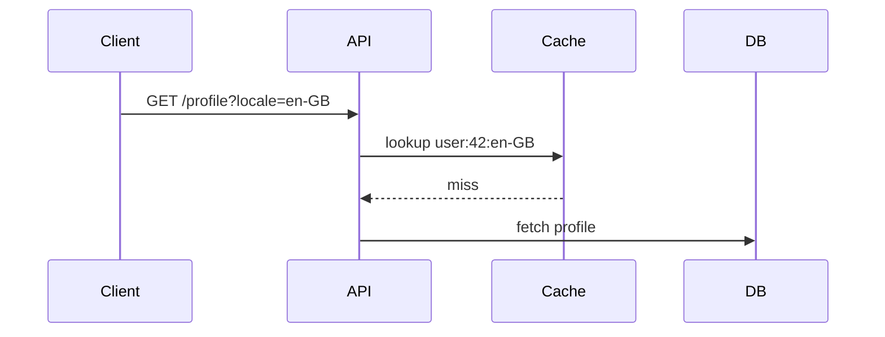

# Cache Locale Explanation

## Background

Profiles are cached so repeated requests do not need to hit the database. The
cache key must describe every input that can change the profile response.

:::callout{type="concept" title="Cache identity"}
Cache identity answers "which value is this?" Cache lifetime answers "how long
may we reuse it?" Mixing those concepts makes correctness depend on timing.
:::

## Intuition

If two requests ask for the same user in different locales, they can legitimately
need different profile text.



## Code

The key now includes locale.

```python {title="src/cache.py" lineStart=41 highlight="42"}
def cache_key(user_id, locale):
    return f"{user_id}:{locale}"
```

:::code-note{target="src/cache.py" lines="42"}
The locale is part of identity, not an expiration policy.
:::

## Quiz

:::quiz{id="locale-key"}
? Why was the old cache key incorrect?
- It ignored the user ID
- It ignored the locale [correct]
- It expired too quickly
- It used the wrong database table

! Locale-specific profile data could collide because the key did not distinguish locale.
:::

:::quiz{id="identity-lifetime"}
? What does cache identity decide?
- Which stored value a request refers to [correct]
- How many seconds a value may live
- Which HTTP client sends the request
- Whether the database is online

! Identity is about naming the value; lifetime is about reuse duration.
:::

:::quiz{id="code-comment"}
? Where should explanatory notes about real source code go?
- In fake comments inserted into copied code
- In separate code notes [correct]
- In the filename only
- In the table of contents

! Code notes explain the snippet while keeping copied source faithful.
:::

:::quiz{id="diagram-runtime"}
? When is Mermaid rendered?
- At HTML viewing time in the browser
- At build time into inline SVG [correct]
- By a remote CDN
- Only when the reader clicks the diagram

! The final HTML is offline, so Mermaid is converted during rendering.
:::

:::quiz{id="final-output"}
? What should the final artifact be?
- A Markdown file only
- A self-contained HTML file [correct]
- A remote web page
- A JSON report

! The Markdown is intermediate; the deliverable is one offline HTML file.
:::
