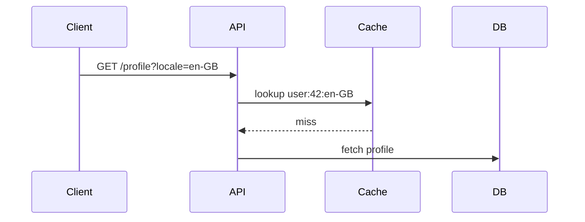

# Explain Diff Markdown Dialect

Use ordinary Markdown plus these small extensions.

## Document Shape

Use one title and these required sections:

```md
# Descriptive explanation title

## Background
...

## Intuition
...

## Code
...

## Quiz
...
```

The renderer generates the table of contents from headings.

## Callouts

```md
:::callout{type="concept" title="Key idea"}
The new code separates cache identity from cache lifetime.
:::
```

Supported `type` values: `concept`, `note`, `warning`, `edge`, `example`.

## Code Blocks

````md
```python {title="src/cache.py" lineStart=41 highlight="45-47"}
def cache_key(user_id, locale):
    return f"{user_id}:{locale}"
```
````

Metadata:

- `title`: optional filename or path shown in the code card.
- `lineStart`: first displayed line number. Defaults to `1`.
- `highlight`: comma-separated line numbers or ranges, using displayed line
  numbers, for example `"3,8-12"`.
- `note`: optional short note shown below the code.
- `toy`: set to `true` only when the snippet is example code rather than copied
  source.

Do not insert explanatory comments into real copied source. Use `:::code-note`
instead.

```md
:::code-note{target="src/cache.py" lines="45-47"}
This is where the locale becomes part of the cache key.
:::
```

`target` matches the code block `title`.

## Mermaid Diagrams

````md

````

Use Mermaid for system/data-flow, sequence, before/after, data-shape, and
state-transition diagrams. The renderer converts diagrams to inline SVG.

## HTML/CSS Diagram Blocks

Use only for simple UI mockups or diagrams Mermaid cannot express well.

```md
:::diagram{title="Simplified UI"}
<div class="ui-mock">
  <div class="ui-toolbar">Profile</div>
  <div class="ui-row">Locale: en-GB</div>
</div>
:::
```

Keep HTML semantic and simple. Do not include scripts, remote assets, or SVG
unless necessary.

## Quiz Blocks

```md
:::quiz{id="cache-key-quiz"}
? Why was the old cache key incorrect?
- It ignored the user ID
- It ignored the locale [correct]
- It expired too quickly
- It used the wrong database table

! Region-specific profile data could collide because the cache key did not distinguish locale.
:::
```

Rules:

- Put one question per `:::quiz` block.
- Each quiz must have exactly one `[correct]` answer.
- Put answer feedback after `!`.
- The final explanation should include five quiz blocks.
